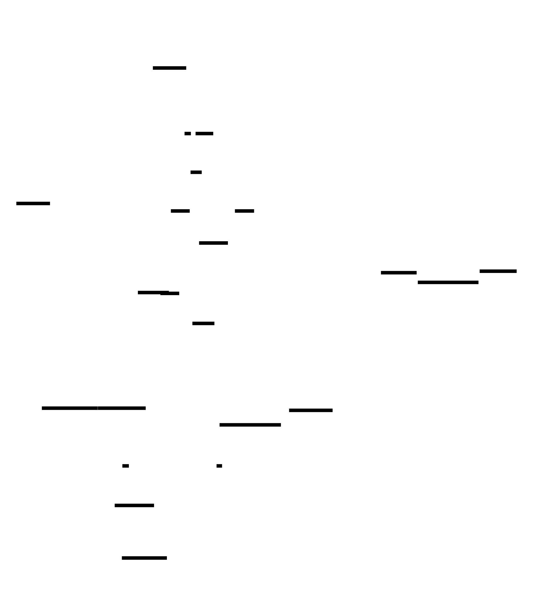

# Cara: High-Level Design

*The five-minute orientation. The full specification is [`ARCHITECTURE.md`](ARCHITECTURE.md), which governs wherever the two disagree. Diagram source: `diagrams/architecture.d2`.*

# 



# 

## The idea

Cara is a from-scratch browser in **Zig** that does not render the web. Pages are declared in **Glyph** (a four-rule markup language), styled with a locked ~220-utility vocabulary, scripted in **Luau**, laid out by single-pass constraint propagation, and painted through a data-oriented scene graph. Two constraints outrank everything: anything more complex than strictly necessary gets cut, and **idle costs nothing**: a browser nobody is looking at should be indistinguishable from one that is not running.

## The shape: two processes, two channel kinds

A privileged **host** owns the OS: window, event pump, GPU device, network, storage, clipboard, accessibility, hit-testing, and the spawner. A sandboxed **renderer** (one per origin) owns the page: parsing, scene graph, style, layout, paint, text shaping and rasterization, image decoding, and the Luau VM. Bulk data crosses **shared memory**; control crosses a **Unix-socket IPC channel**. There is no third boundary, and no pointer ever crosses either one.

## The transports

| Transport | Semantics | Synchronization | Why this shape |
|---|---|---|---|
| **3 frame slots** | latest-wins, skippable | one packed word `latest` (slot, dirty, gen); producer release-exchanges, consumer **checks then** exchanges | frames are replace-semantics; a slow host paints only the newest and never walks a stale frame |
| **Atlas stream** | exactly-once, ordered | monotonic `atlas_head` / `atlas_tail` cursors, Release/Acquire, wrapping `-%`, capacity ≥ one frame's additions | a skipped frame must never drop a glyph bitmap; it is the one flow in the system that is genuinely a stream |
| **Image staging** | idempotent | `(resource_id, offset, size)` references repeat until `UploadDone` | decode stays jailed; re-references make frame-skipping safe |
| **IPC socket** | 13 typed messages | length-prefixed envelope; doubles as the signaling layer (kqueue/epoll) | portable on both targets; one signal per frame needs no futex |

Frame slots start at 256 KiB each (geometry self-describing). The staging region is host-created and its fd passed once via `SCM_RIGHTS`: the jailed renderer can open nothing, and it keeps that fd so a `Resize` grow is a single `mmap`. The region is grow-only; the host `ftruncate`s up **before** sending `Resize`.

## The 13 messages

| Message | Direction | Purpose |
|---|---|---|
| `SpawnRenderer` | host internal | bring up a renderer for an origin |
| `LoadPage` | host → renderer | deliver the page bundle |
| `Fetch` / `FetchResult` | renderer ↔ host | network resources; host-origin-enforced + SSRF-filtered |
| `StorageOp` / `StorageResult` | renderer ↔ host | per-origin SQLite KV; bound to host-assigned origin |
| `InputEvent` | host → renderer | input; generational `hit_entity` + `frame_seq` pre-resolved |
| `FrameReady` | renderer → host | new slot published; carries `wants_tick` |
| `FrameTick` | host → renderer | vsync, **only while armed**; paces animation |
| `UploadDone` | host → renderer | image staging consumed, reusable |
| `A11yUpdate` | renderer → host | AccessKit tree projection |
| `Resize` | host → renderer | viewport + staging’s new size (sent after the grow) |
| `ProcessHealthcheck` | host ↔ renderer | liveness |

## One frame's journey

```
signal mutates
  -> a DirtyFlags bit is set (the render gate: no bit, no frame)
  -> style / layout / shaping rerun for dirty entities only
  -> new glyph bitmaps append to the atlas stream (head advances)
  -> paint emits the FULL display list + damage rects into the back slot
  -> release-exchange of latest, then -- and only then -- FrameReady(wants_tick)

host wakes on FrameReady
  -> acquire-load latest; proceed only if dirty (coalesced wakeups are normal)
  -> exchange-take the newest slot; stale frames are skipped, never walked
  -> drain the atlas stream to head (atlas_head_required is the floor)
  -> upload any staged images by resource_id
  -> encode: cull leaf commands against damage at buffer age 1,
     re-encode the full held slot at age != 1 or unknown
  -> one render pass: color + ID buffer (generational handles); present
  -> FrameTick on vsync only while wants_tick is armed; otherwise nobody wakes
```

Idle is genuinely zero: no frame loop, no timer ticks while clean, 0% CPU, 0% GPU. The only wakeups are input, armed `FrameTick`, and IPC traffic.

## Ownership map

| Concern | Owner | Note |
|---|---|---|
| Window, vsync, present | host | sends `FrameTick` while armed |
| GPU device, atlas texture, ID buffer | host | behind the `gpu.zig` seam |
| Hit-testing | host | one ID-buffer pixel = generational entity handle, O(1) |
| Network, storage, clipboard, a11y bridge | host | renderer reaches them only via IPC |
| Parsing, scene, style, layout, paint | renderer | DirtyFlags drive all incremental work |
| Text shaping, rasterization, **atlas layout** | renderer | font parsing jailed; host only mirrors the texture |
| Image decoding | renderer | decoder jailed; host only uploads |
| Scripting | renderer | Luau compiled from source in the jail; bytecode never crosses trust |

## Security: two halves

**The boundary (its shape).** The renderer runs with **no executable memory** (Luau is interpreter-only, so the sandbox denies `mmap(PROT_EXEC)` outright), under seccomp-BPF on Linux: read/write, `recvmsg` for the staging fd, no-exec `mmap`, `futex`, `getrandom`, the small unavoidable tail, with `open`/`socket`/ `exec` and the known bypasses (`io_uring`, `userfaultfd`, `ptrace`, `process_vm_*`) denied, the filter installed before any thread spawns, and a Seatbelt profile on macOS (deprecated API, defense-in-depth; privilege minimization is the real macOS mitigation). `CLOEXEC` everywhere; the renderer inherits exactly the shm fds and the socket. Per-renderer cgroup/RLIMIT caps plus a watchdog fence DoS; shared regions are `memfd` + `F_SEAL_SHRINK`.

**Crossing it (its contract, §5.17).** A *typed* surface over hostile input is an attack surface, not a safety property; the renderer is the hostile input source the whole design posits. So **the host validates every renderer-supplied byte (frame slots, atlas stream, cursor words, IPC envelopes) against host-owned bounds before use.** The display-list consumer is a *validating parser, not a trusting cast*: lengths bounded, indices range-checked, and the read **robust to a mutating producer** (each field read once into a local, arithmetic written so a mid-read mutation yields garbage pixels, never an OOB access, keeping zero-copy without conceding memory safety). The slot index and atlas cursor are masked/clamped; no geometry crosses shared memory: it is
comptime in the shared module, and the host's copy is authoritative. `Fetch` is host-origin-enforced and SSRF-filtered (the **resolved, normalized IP is validated and pinned for the dial** (DNS-rebinding-proof), re-done per redirect; loopback/link-local/private/metadata refused); storage is bound to the host-assigned origin. A full renderer compromise then yields a process with no filesystem, no network, no exec, and a thirteen-message *validated* surface.

**The TCB, named honestly.** The renderer-side parsers history punishes most (font shaping, image decode, script compile) are jailed. But the host stays trusted, and inside it run vendored parsers that also touch hostile or persisted bytes: **libcurl + HTTP/2 + TLS** (the wire), **SQLite** (disk), the **GPU driver / wgpu-native**, **AccessKit**. A memory-safety bug in any of these is direct host compromise, unsandboxed; the trust gradient is partly inverted, named rather than hidden. They are kept thin; a network-fetch broker to flatten the gradient is on the far-horizon roadmap.

## Memory in one paragraph

Allocation is architecture: lifetime-keyed arenas (parse / frame / page / process / shared), u32 indices never pointers, strings interned once. Fonts and Unicode tables are `mmap`'d read-only so the page cache shares them across renderers; the zygote fork is **Linux-only** (macOS fork-without-exec is a tripwire, `posix_spawn` there); background origins freeze. RSS ceilings are asserted in CI; a memory regression fails the build.

## The one open decision ⚑

The GPU backend behind the non-negotiable `gpu.zig` seam: **hand-rolled Metal + Vulkan** (zero deps, total control, real Vulkan labor) versus **wgpu-native** (one C API, battle-tested correctness, a vendored binary). Honest favorite: wgpu-native. Resolved by the Phase-3 spike, whose pass bar is swapchain resize + present-sync on Wayland + a non-stalling one-pixel ID readback per candidate, not "clear a color." Either way the seam stays, so the bet is reversible.

## The invariants that bite (each one is a found bug, pinned)

- **Check, then exchange**: an unconditional exchange on a coalesced `FrameReady` trades the host's only good frame for a stale slot.
- **Publish strictly before signal**: a `FrameReady` racing its publish is a lost frame.
- **Bitmaps never ride in frames**: skipped frame, lost bitmap, garbage texels; the atlas stream exists because of this.
- **Atlas capacity ≥ one frame's additions**: otherwise the first glyph-dense screen deadlocks: tail only advances on consumption, and an unpublished frame can never be consumed.
- **`ftruncate` before `Resize`, grow-only**: the capacity guarantee must happen-before the message that licenses larger production.
- **Full display list every produced frame**: the host is stateless; partial frames are a protocol violation.
- **Damage only at buffer age 1**: otherwise re-encode the full held slot.
- **Cull leaf commands only**: culling a `Clip` push/pop corrupts everything after it.
- **The ID buffer stores the generational handle, never the bare index**: `frame_seq` says the frame is old; the generation says *this* entity is dead. Different deaths, different checks.
- **The host validates every renderer-supplied byte against its own bounds**: slots, atlas stream, cursor words, IPC envelopes. A *validating parser, not a trusting cast*; "typed surface" and "`@ptrCast` in place" are an attack surface and a corruption primitive until this holds.
- **Validation is robust to a mutating producer**: the renderer can write the slot the host is reading; read each field once into a local, bound the arithmetic so the worst case is garbage pixels, never OOB. Zero-copy kept, memory safety not conceded.
- **`Fetch` is host-origin-enforced and SSRF-filtered**: the origin is the one the host assigned, never one the renderer names; loopback/link-local/private/metadata refused; the resolved, normalized IP is pinned for the dial (DNS rebinding closed), re-done per redirect. Denying the renderer `socket` buys nothing otherwise.
- **Never load Luau bytecode**: always compile from source in the jail; no disk bytecode cache, ever, or the unsafe-deserialization vector returns.

## Roadmap, one line per phase

1. Frame slots (`ring.zig` → `frame.zig`; cursor pair extracted, it ships again in the atlas stream)
2. Wire protocols; kill the busy-wait; prove 0% idle
3. Host renderer; the ⚑ GPU spike; ID buffer; hit-test; resize
4. Text Trinity; atlas stream; `DrawTextRun`
5. Renderer brain: ECS, Glyph parser, style, Strict-Box, paint
6. Luau, reactivity, events, first components
7. Host services: net, storage, clipboard, AccessKit, image pipeline
8. Sandbox enforced: no-exec jail, musl-static renderer, per-origin isolation, **plus the §5.17 trust-boundary contract** (host-side validating parser, `Fetch` SSRF filter, storage origin-binding, resource fencing). The phase that makes the split *true*.
9. Memory: mmap'd fonts, RSS budgets in CI, Linux zygote, freeze
10. Far horizon: multi-tab, animation, HTTP/3, atlas eviction, network-fetch broker (flatten the TCB), devtools

# 

*Status: the transport foundation is built and proven; everything else is the map. Spec governs: [`ARCHITECTURE.md`](ARCHITECTURE.md).*
